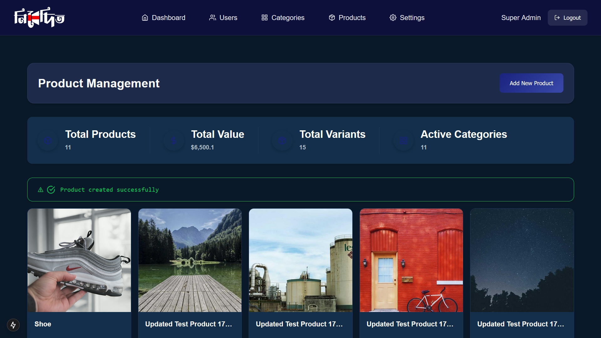
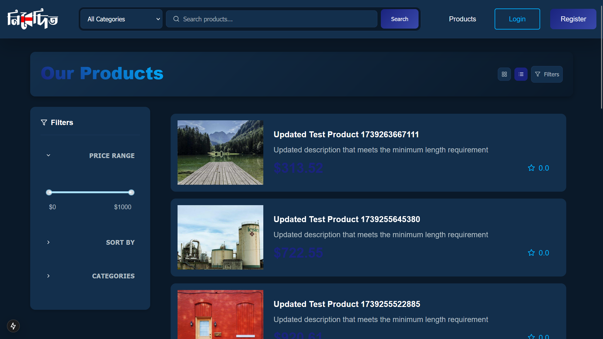
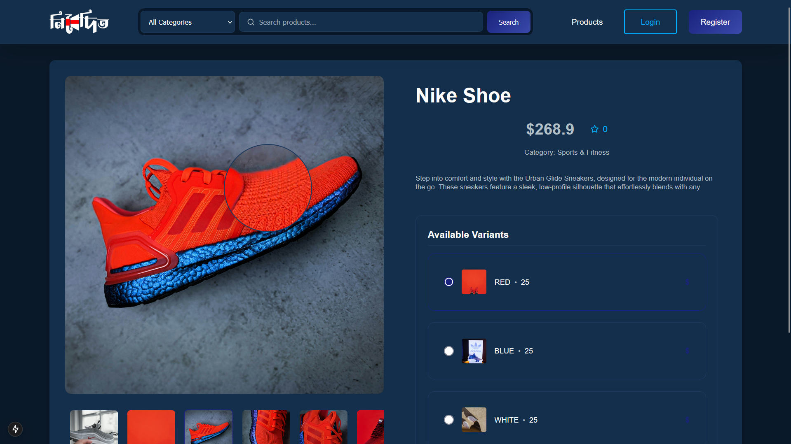

# Nibedito E-commerce Platform

A full-stack gift and e-commerce store: product catalogue, cart, checkout,
orders, reviews, coupons and a full admin panel.

This file covers setup, configuration and everything outstanding before
production. Two companions go deeper without repeating any of it:

- [`backend/README.md`](./backend/README.md) — endpoint-by-endpoint API reference
- [`frontend/README.md`](./frontend/README.md) — app structure and the
  conventions to follow when changing the UI

## Demo Screenshots






## Tech Stack

**Frontend** — Next.js 15 (App Router) · React 19 · TypeScript · Tailwind CSS ·
Radix UI · TanStack Query · axios · framer-motion

**Backend** — Node.js · Express · MongoDB with Mongoose · JWT in httpOnly
cookies · bcryptjs · Cloudinary (image storage) · Nodemailer · express-validator ·
express-rate-limit

## Features

**Storefront** — product catalogue with search, filtering and pagination ·
categories and subcategories · product detail pages with image galleries ·
cart · checkout with shipping rates and coupons · order history · product
reviews with images · wishlist

**Accounts** — registration with email activation · login · password reset ·
email change verification · profile and address management · security settings

**Admin** — dashboard · products · categories and subcategories · orders ·
users (view, ban, unban) · coupons · shipping rates · FAQs

---

# Running it locally

Two options. Docker is the least fiddly and is what the rest of this section
assumes.

## Option 1 — Docker (recommended)

Only Docker is required; you do not need Node, MongoDB or a mail server
installed on your machine.

```bash
docker compose up --build
```

That starts four containers: the frontend, the API, a MongoDB instance, and a
mail catcher. First run takes a few minutes while images build.

The local database starts empty, so seed some products:

```bash
docker compose run --rm api node scripts/seed-dev.js
```

| Service | URL |
|---|---|
| Storefront | http://localhost:3000 |
| API health check | http://localhost:3001/health |
| Mailbox | http://localhost:8025 |
| MongoDB | `mongodb://localhost:27017/nibedito` |

**The mailbox matters.** Registration sends an activation email and the account
cannot be used until the link is opened. Nothing is sent to a real address
locally — every outgoing message is captured at http://localhost:8025, where you
can open the activation link.

Backend environment variables are read from `backend/.env`, which is mounted
into the container. Copy the template and fill it in before the first run:

```bash
cp backend/.env.example backend/.env
```

Stopping:

```bash
docker compose down
```

Add `-v` to also delete the local database volume:

```bash
docker compose down -v
```

### Rebuilding after changes

The containers run a production build, so code changes need a rebuild:

```bash
docker compose up --build
```

If you change `NEXT_PUBLIC_API_URL`, you **must** rebuild the frontend image
rather than restart it — see [Gotchas](#gotchas) below.

## Option 2 — Node directly

Requires Node.js 20+ and a MongoDB you can reach (local install or Atlas).

**Backend**

```bash
cd backend && npm install && npm run dev
```

Note `npm install`, not `npm ci --omit=dev`: `morgan` is required at runtime but
declared under `devDependencies`, so a production-only install produces a server
that will not boot.

**Frontend**, in a second terminal:

```bash
cd frontend && npm install && npm run dev
```

The frontend runs on port 3000 and the API on 3001.

Without Docker there is no mail catcher, so `SMTP_*` must point at a real SMTP
server or registration will fail — the account is deleted and the request
returns 500 if the activation email cannot be sent.

---

# Configuration

## `backend/.env`

| Variable | Purpose |
|---|---|
| `SERVER_PORT` | Port the API listens on (3001 locally) |
| `NODE_ENV` | `development` locally, `production` when deployed. See [Gotchas](#gotchas) |
| `CLIENT_URL` | Frontend origin. Used for CORS and for links inside emails. Exact match, no trailing slash |
| `MONGODB_ATLAS_URL` | MongoDB connection string |
| `JWT_ACCESS_KEY` | Signs access tokens (15 minute lifetime) |
| `JWT_REFRESH_KEY` | Signs refresh tokens (7 day lifetime) |
| `JWT_ACTIVATION_KEY` | Signs account-activation and password-reset links |
| `SMTP_EMAIL` / `SMTP_PASSWORD` | Mail account credentials |
| `SMTP_HOST` / `SMTP_PORT` | Optional. Defaults to `smtp.gmail.com` and `587`. Compose points these at the local mail catcher |
| `CLOUDINARY_CLOUD_NAME` / `CLOUDINARY_API_KEY` / `CLOUDINARY_API_SECRET` | Product and profile image uploads |
| `DEFAULT_USER_PICTURE` | Fallback avatar URL |
| `DEFAULT_USER_PASSWORD` | Used by the test-user seed script |
| `SUPER_ADMIN_EMAIL` / `SUPER_ADMIN_PASSWORD` / `SUPER_ADMIN_PHONE` | Credentials for the admin account created by `createDefaultAdmin.js` |

## `frontend/.env.local`

| Variable | Purpose |
|---|---|
| `NEXT_PUBLIC_API_URL` | API base URL, including `/api` — e.g. `http://localhost:3001/api` |
| `NEXT_PUBLIC_CLOUDINARY_URL` | Cloudinary delivery base URL |
| `NEXT_PUBLIC_WHATSAPP_PHONE_NUMBER` | Number used by the support widget |

Both files are gitignored. Never commit real credentials.

---

# Scripts

Run these inside the API container (`docker compose run --rm api …`) or from
`backend/` directly.

| Command | Effect |
|---|---|
| `node scripts/sync-catalogue.js` | Copies categories, subcategories and products from the cloud database into the local one, so development shows the same catalogue as the live site. Reads the cloud only; refuses to write into a hosted cluster. Accounts, carts and orders are never copied |
| `node scripts/check-smtp.js [email]` | Checks the mail server is reachable and the credentials work. Pass an address to send a test message |
| `node scripts/seed-dev.js` | Seeds a category and three products for local development. Refuses to run against a hosted cluster |
| `node src/scripts/createDefaultAdmin.js` | Creates the admin account from the `SUPER_ADMIN_*` variables. Needed before you can sign in at `/admin-login` |
| `node src/scripts/seed/seedCategories.js` | Seeds the full category tree |
| `node src/scripts/seed/seedProducts.js` | Seeds a larger product catalogue |
| `node src/scripts/seed/seedTestUsers.js` | Creates test user accounts |

The seed scripts delete existing documents in the collections they populate.
Only point them at a database you are willing to lose.

---

# Gotchas

Four things that cost real debugging time. Worth reading before you hit them.

### `NEXT_PUBLIC_*` is baked in at build time

Next.js inlines these into the client bundle when it builds; they are not read
at runtime. Setting `NEXT_PUBLIC_API_URL` as a container environment variable
does nothing. Changing it requires rebuilding the frontend image, and on a
hosting platform it means a fresh build (clear the build cache), not a restart.

### `NODE_ENV` decides whether login works at all

Auth cookies are only sent with `SameSite=None; Secure` when `NODE_ENV` is
exactly `production`. Otherwise they go out `SameSite=Strict`.

- **Locally** you want `development`. Frontend and API are both on `localhost`,
  which counts as the same site, and `Secure` cookies would be rejected over
  plain http.
- **Deployed**, where the frontend and API are on different hosts, `production`
  is required. Without it the browser silently refuses to send the cookie, login
  appears to succeed, and every subsequent request arrives unauthenticated —
  which looks exactly like being logged out at random.

`GET /health` reports which mode is active:

```json
{ "status": "ok", "database": "connected", "environment": "production",
  "authCookieMode": "SameSite=None; Secure (cross-site OK)" }
```

### `morgan` is a runtime dependency in the wrong section

`src/app.js` requires it on startup, but it sits under `devDependencies`. Any
production-only install produces a server that crashes with `MODULE_NOT_FOUND`.
Install with dev dependencies included until it is moved.

### Free hosting tiers often block outbound SMTP

Render's free web services stopped allowing outbound traffic to ports 25, 465
and 587 in September 2025, and port 25 is blocked on every plan. Nothing in the
application reports this usefully on its own: the connection to the mail server
simply times out, registration fails at the point it tries to send the
activation email, and the account is rolled back.

Check it with:

```bash
docker compose run --rm \
  -e SMTP_HOST=smtp.gmail.com -e SMTP_PORT=587 \
  api node scripts/check-smtp.js
```

`ETIMEDOUT` from a deployment while the same command succeeds from a laptop
means the host is blocking the port, not that the credentials are wrong.

Two ways out: pay for an instance type that permits SMTP, or send through a
provider's HTTPS API — Resend, SendGrid, Mailgun, Postmark — which uses port 443
and is unaffected.

### Field rules live in one file

`backend/src/constants/validationRules.js`, mirrored by exported constants in
`frontend/src/utils/validation.ts`. Change both together.

This is the mistake that has produced the most bugs here. Each rule used to be
written out separately in the validator, the schema, sometimes an inline check
in a controller, and again in the browser — and they drifted. The result is
always the same: the form accepts something, the API refuses it, and the person
gets two contradictory messages for one mistake, one under the field and a
differently worded one above the form.

Current rules:

| Field | Rule |
|---|---|
| Password | 8+ characters, with an uppercase letter, a lowercase letter and a number |
| Name | 3–30 characters |
| Phone | exactly 11 digits, stored beginning with 0 |

Admin accounts keep their own stricter password rule and a 10-digit phone in
`adminModel.js`; that is a separate collection and is not covered by these.

---

# Before production

Known gaps, roughly in the order they would hurt. Nothing here blocks local
development or a demo, but the first two sections should be closed before the
site takes real customers.

## Blocking

- [ ] **Email cannot be sent from the current host.** Render's free tier blocks
      outbound SMTP, so registration and password reset fail. Either move to a
      paid instance or switch `helper/email.js` to a provider's HTTPS API. See
      the SMTP note under Gotchas.
- [ ] **Rotate the database password.** The old one appeared in startup logs
      before those were redacted, so treat it as public.
- [ ] **No automated tests anywhere.** `npm test` is still the placeholder that
      exits 1. Most bugs found so far were one-line mismatches between two
      copies of the same rule - exactly what a small API test suite around auth,
      validation and checkout would have caught.

## Half-built features

- [ ] **Wishlist.** `User.wishlist` exists and `POST /products/:slug/wishlist`
      adds to it, but there is no endpoint to list or remove, and no
      `/wishlist` page. The nav entries are deliberately left in place - in the
      account sidebar, the profile dropdown, quick actions and the empty cart -
      and currently 404.
- [ ] **Phone verification.** `verificationStatus.phone` is stored and shown but
      nothing ever sets it. The UI says "coming soon".
- [ ] **Support widget is not a chatbot.** Typing a message opens WhatsApp; no
      reply arrives in the panel. Fine as a handoff, but it is not automated
      support.
- [ ] **Homepage is mostly static.** `CategoryGrid`, `HeroSection` and
      `Features` render `constants/dummyData.ts`, so the category grid shows
      eight invented categories that contradict the real ones in the navbar.
      Only the product strip reads the API.
- [ ] **Admin profile has three dead actions.** Edit, settings and quick-action
      navigation in `components/admin/dashboard/AdminProfile.tsx` are TODO stubs
      that do nothing when clicked.

## Security hardening

- [ ] **No `helmet`.** The API sets no security headers at all — no CSP, HSTS,
      `X-Content-Type-Options` or frame protection. One `app.use(helmet())` in
      `app.js` covers most of it.
- [ ] **Rate limiting is one global bucket**: 300 requests per minute per IP
      across every route. That allows 300 password guesses a minute against
      `/api/auth/login`. Auth endpoints want their own much tighter limiter.
- [ ] **No `compression`.** Responses are sent uncompressed; product listings
      are the obvious cost.

## Auth hardening

- [ ] **Refresh tokens are not rotated** and there is no reuse detection, so a
      stolen one is good for its full 7 days.
- [ ] **Logout does not revoke.** Cookies are cleared but the JWT stays valid
      until it expires.
- [ ] **`isBanned` is read from the token**, so a ban takes up to 15 minutes to
      take effect.
- [ ] **Users and admins share one cookie name and one signing key.** No
      privilege escalation - the admin lookup requires a matching Admin document
      - but the two sessions overwrite each other.

## Data and correctness

- [ ] **`ratings` has two shapes.** Older product documents hold an array where
      the schema now says Number. Needs a migration.
- [ ] **`averageRating` is redundant.** It is 0 on every product while `ratings`
      carries the real value. Pick one.
- [ ] **Mongoose validation messages reach the client** verbatim, so schema
      wording is user-facing.
- [ ] **A failed database connection does not stop the server.** It logs and
      carries on, so the API serves 500s instead of failing to start. The
      connection error listener is also registered after `connect`, so it is
      never attached if the first attempt throws.

## Cleanup

- [ ] **~30 lint warnings**, mostly `react-hooks/exhaustive-deps` on
      `fetchOrders` and `fetchReviews`. The usual cause of stale data after a
      refetch.
- [ ] **`dotenv` is bundled into the client.** It is in the frontend
      dependencies and something pulls it in; dead weight in the browser.
- [ ] **Decorative `absolute inset-0` overlays** need a positioned parent. Four
      pages had one resolving against the viewport, covering the page and
      swallowing clicks. Others may remain - the pattern to look for is an
      `absolute inset-0` sibling under a parent without `relative`.
- [ ] **`components/ui` holds unused shadcn scaffolding** pulled in wholesale.
      Worth pruning to what is actually used.

---

# Deployment

The two halves deploy as separate services from this one repository, each with
its own root directory.

| | Backend | Frontend |
|---|---|---|
| Root directory | `backend` | `frontend` |
| Build command | `npm ci --include=dev` | `npm ci --include=dev && npm run build` |
| Start command | `npm start` | `npm start` |
| Health check path | `/health` | — |

`--include=dev` is required for both: the frontend build needs TypeScript and
Tailwind, and the backend needs `morgan` at runtime.

Deploy the backend first so you know its URL, point the frontend's
`NEXT_PUBLIC_API_URL` at `https://<backend-host>/api` and build it, then set the
backend's `CLIENT_URL` to the frontend URL and redeploy. `CLIENT_URL` is matched
exactly by CORS, so no trailing slash.

Set `NODE_ENV=production` on the backend. See [Gotchas](#gotchas) for why this
one is not optional.

---

# Project structure

```
backend/
  src/
    constants/     shared rules, e.g. the password policy
    controllers/   request handlers
    models/        Mongoose schemas
    routers/       route definitions, all mounted under /api
    validators/    express-validator chains
    helper/        email, JWT helpers
    scripts/       seed and admin-creation scripts
    app.js         express app, middleware, /health
    server.js      entry point
frontend/
  src/
    app/           App Router pages, grouped (auth) (user) (admin)
    components/    UI, grouped by feature
    contexts/      auth, admin auth, cart
    services/      typed API clients
    types/         shared TypeScript types
    utils/         axios instance and interceptors, validation
docker-compose.yml
```

API routes are all mounted under `/api` — `/api/products`, `/api/auth`,
`/api/cart` and so on. The bare root path returns 404 by design; use `/health`
to check the server is up.
